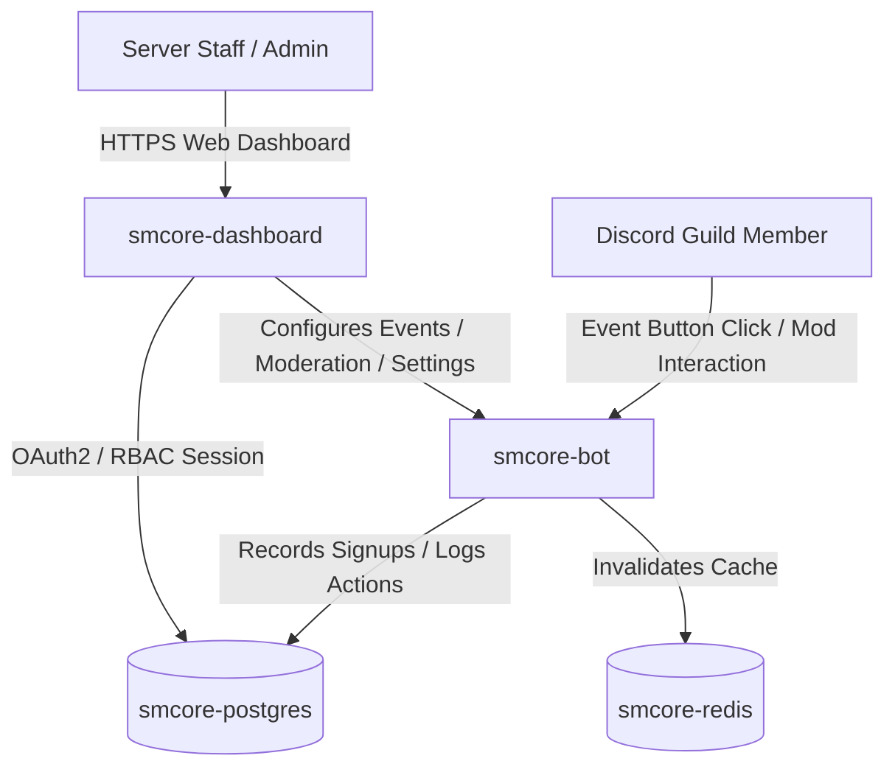

# SMCore Discord Bot – System Architecture

## Architecture Overview

**SMCore Discord Bot** follows a modular monorepo architecture engineered for high concurrency, multi-tenant server isolation, and real-time responsiveness.

---

## Workspace Components

1. **`smcore-bot` (`apps/bot`)**:
   - Built with Discord.js v14.
   - Listens to Discord Gateway events.
   - Handles Event Signups, Moderation actions, Welcome greetings, and Grand RP promotion tracking.
   - Assigns Discord guild roles dynamically.

2. **`smcore-dashboard` (`apps/web`)**:
   - Built with Next.js 14 App Router, React 18, and Tailwind CSS.
   - Serves the **SMCore Dashboard** UI and REST API endpoints.
   - Implements Discord OAuth2 authentication and Role-Based Access Control (RBAC).

3. **`@repo/database` (`packages/database`)**:
   - Managed with Prisma ORM 5.22.
   - Stores multi-tenant guild configurations, staff permissions, event signups, welcome configs, moderation logs, promotion logs, and audit logs.

---

## Multi-Tenancy & Data Isolation

All configuration tables (`GuildSettings`, `ChannelConfiguration`, `RoleConfiguration`, `StaffPermission`, `EventSignup`, `WelcomeConfig`, `ModerationLog`, `PromotionLog`, `AuditLog`) enforce composite key relationships and indexing on `guildId`. Data for Guild A is completely isolated from Guild B.

