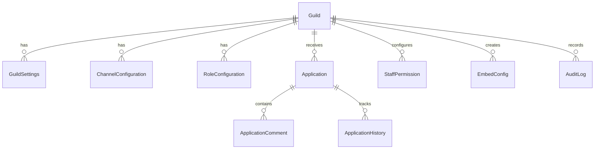

# Nexus Discord Bot – Database Architecture

Database schema documentation for **Nexus Discord Bot**. Managed via Prisma ORM 5.22 against PostgreSQL 15.

---

## Entity Relationship Summary

---

## Model Descriptions

- **Guild**: Stores registered Discord servers, owner IDs, and bot join timestamps.
- **GuildSettings**: Stores cooldowns, DMs, logging toggle, screenshot rules, embed colors, timezone.
- **ChannelConfiguration**: Binds request, review, and log channel IDs per guild.
- **RoleConfiguration**: Stores requestable roles, min rank requirements, and display order.
- **Application**: Tracks user role requests, applicant info, screenshot proof, status, rejection reason, reviewer tags.
- **ApplicationComment**: Private internal staff discussion notes on applications.
- **AuditLog**: Comprehensive audit log of all system actions.
