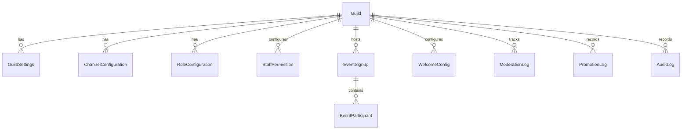

# SMCore Discord Bot – Database Architecture

Database schema documentation for **SMCore Discord Bot**. Managed via Prisma ORM 5.22 against PostgreSQL 15.

---

## Entity Relationship Summary

---

## Model Descriptions

- **Guild**: Stores registered Discord servers, owner IDs, and bot join timestamps.
- **GuildSettings**: Stores cooldowns, DMs, logging toggle, embed colors, timezone.
- **ChannelConfiguration**: Binds logging channels, moderation logs, voice logs, message logs, and promotion channels.
- **RoleConfiguration**: Synchronizes and caches Discord guild roles and display settings.
- **StaffPermission**: Grants administrative access tiers (e.g. `HIGH_COMMAND`) to roles for dashboard and bot management.
- **EventSignup**: Manages on-demand interactive event signups with main team and substitute rosters.
- **EventParticipant**: Tracks individual user signups for events as main team members or substitutes.
- **WelcomeConfig**: Configures welcome embeds, goodbye messages, welcome channel, and auto-roles for new members.
- **ModerationLog**: Records bans, kicks, timeouts, warnings, and purges executed via bot or dashboard.
- **PromotionLog**: Records Grand RP rank promotions, demotions, and left-family actions with in-game details.
- **AuditLog**: Comprehensive audit trail of all dashboard and system management actions.
